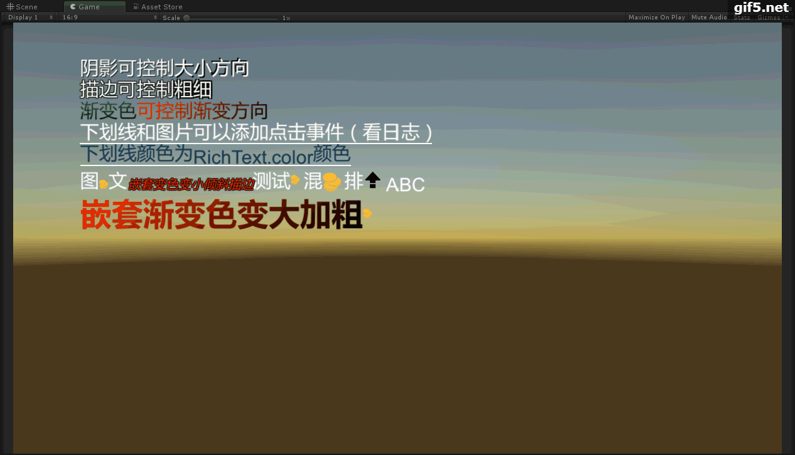

Unity3D UGUI纯脚本实现
测试Unity版本：2017.4.23&Unity5.3.6 理论上支持Unity5.3+的所有版本
有这个ZUIRichText的时候用的是Unity5.3.6，放出来的Demo是在Unity2017.4.23上整理的

这套UI要从2015年说起，那时候UGUI刚兴起，官方只有基础组件，所有东西都要自己造轮子，于是搞了一套ZUI的UGUI封装组件，后来发展了几个项目算是比较系统了。现在这套东西也搁置1,2年了，把富文本开源出来可能还有人用得着，其他的轮子和估计和市面上的都差不多就不放出来了。

